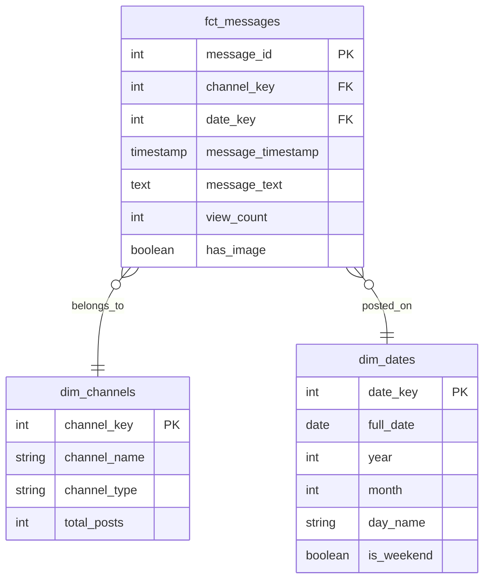

# Interim Report: Telegram Data Platform Implementation

**Date:** January 18, 2026
**Project:** Telegram Medical Data Warehouse
**Organization:** Kara Solutions

---

## 1. Understanding and Defining the Business Objective

### 1.1 Business Goal

The primary objective of this project is to build a scalable, automated data platform for Kara Solutions to generate actionable insights into the Ethiopian medical market. By extracting and analyzing data from public Telegram channels (e.g., manufacturers, distributors, pharmacies), we aim to identify market trends, pricing variations, and product availability.

### 1.2 The ELT Framework

We have adopted a modern **ELT (Extract, Load, Transform)** framework to ensure flexibility and reproducibility:

- **Extract:** Raw data is scraped from Telegram and stored in its native format (JSON/Images) in a Data Lake.
- **Load:** Raw data is loaded directly into a **PostgreSQL** data warehouse without prior transformation, ensuring a complete audit trail.
- **Transform:** Business logic and modeling are applied within the warehouse using **dbt (data build tool)** to create analysis-ready tables.

### 1.3 Key Business Questions

The platform is designed to answer critical questions such as:

1.  **Top Products:** What are the most frequently mentioned medical products?
2.  **Price Variations:** How do prices for specific medicines fluctuate across different channels?
3.  **Visual Analysis:** What types of visual content (promotional vs. informational) drive the most engagement?
4.  **Posting Trends:** What are the peak times and days for channel activity?

### 1.4 Architecture Overview

The system architecture consists of:

- **Data Lake:** A directory-based storage system for raw JSON payloads and images.
- **Warehouse:** Dockerized PostgreSQL instance for structured storage.
- **Transformation Layer:** dbt projects managing SQL transformations and testing.

---

## 2. Discussion of Completed Work and Initial Analysis

### 2.1 Project Structure & Best Practices

We have structured the repository to follow industry best practices, separating concerns into explicit modules:

- `scripts/`: Contains the extraction (`scraper.py`) and loading (`loader.py`) orchestration scripts.
- `medical_warehouse/`: Dedicated dbt project for data transformation.
- `api/`: Placeholder for the future FastAPI application.
- `notebooks/`: Directory for exploratory data analysis (EDA).
- `tests/`: Unit testing suite.
- `logs/`: Centralized logging for traceability.

### 2.2 Task 1: Data Scraping and Collection (Extract)

We successfully implemented a robust extraction pipeline using the `Telethon` Python library.

**Implementation Highlights:**

- **Scraper Logic:** A Python class `TelegramScraper` connects to the Telegram Client API, iterates through channel history, and handles pagination.
- **Rate Limiting:** Implemented generic error handling for `FloodWaitError` to respect Telegram's API limits.
- **Data Lake Structure:** Data is stored using a partition strategy based on date and channel to optimize file management.

```text
data/
├── raw/
│   ├── telegram_messages/          # Message JSONs
│   │   └── 2026-01-18/             # Partitioned by Date
│   │       ├── CheMed123.json
│   │       └── lobelia4cosmetics.json
│   └── images/                     # Downloaded Media
│       ├── CheMed123/              # Organized by Channel
│       │   ├── 97.jpg
│       │   └── 98.jpg
```

### 2.3 Task 2: Data Modeling and Transformation (Load & Transform)

For the transformation layer, we implemented a **Star Schema** to optimize for analytical queries.

#### Star Schema Design

The schema centers around message events, supported by dimensions for channels and time.



#### Staging & Transformations

Before creating the star schema, raw data passes through a staging layer (`stg_telegram_messages`) where we apply:

1.  **Type Casting:** Converting ISO8601 strings to native PostgreSQL `TIMESTAMP` and `DATE` types.
2.  **JSON Extraction:** Extracting specific fields from the `raw_payload` JSONB column.
3.  **Enrichment:** creating flags like `has_image` (boolean) and calculating `message_length`.

#### Data Quality Issues & Resolution

During implementation, we encountered and resolved several key issues:

| Issue                       | Impact                                                                   | Resolution                                                                                             |
| :-------------------------- | :----------------------------------------------------------------------- | :----------------------------------------------------------------------------------------------------- |
| **Postgres Authentication** | Loader failed to connect to DB container.                                | Diagnosed network isolation; used `host.docker.internal` logic and standardized ports/creds in `.env`. |
| **Port Conflict**           | Local Postgres conflicted with Docker (Port 5432).                       | Remapped Docker container and loader applications to use Port **5433**.                                |
| **JSON Serialization**      | Python `dict` objects inside lists were not compatible with SQL `JSONB`. | Implemented explicit `json.dumps()` serialization in the loader script before insertion.               |

#### dbt Testing

To ensure ongoing data quality, we implemented the following automated tests in dbt:

- **Schema Tests:** `unique`, `not_null` on primary keys; `relationships` (referential integrity) between Fact and Dimensions.
- **Business Logic Tests:**
  - `assert_no_future_messages`: Ensures no message has a timestamp greater than the current system time.
  - `assert_non_negative_views`: Validates that `view_count` is never less than zero.

---

## 3. Next Steps and Key Areas of Focus

The project is on track. The upcoming phases focus on enriching the data with AI and making it accessible via API.

### 3.1 Task 3: Data Enrichment (Object Detection)

- **Goal:** Detect and classify objects in the scraped images (e.g., "medicine bottle", "box", "text").
- **Approach:** Integrate **YOLOv8** model to process images in `data/raw/images/`.
- **Output:** Store detection results (labels, confidence scores, bounding boxes) in a new `raw.image_detections` table and link it to `fct_messages`.

### 3.2 Task 4: Analytical API (FastAPI)

- **Goal:** Serve insights to the frontend or external systems.
- **Features:**
  - Endpoint for **Top Products** (aggregated from text analysis).
  - Endpoint for **Channel Activity** (volume over time).
  - **Search**: Full-text search capability for messages.

### 3.3 Task 5: Pipeline Orchestration (Dagster)

- **Goal:** Automate the end-to-end workflow (Scrape → Load → Transform → Enrich).
- **Challenge:** Managing dependencies between Python scripts and dbt models.
- **Approach:** Define software-defined assets in Dagster to trigger the scraping job, wait for completion, run the dbt build, and then trigger the YOLO inference.

---

_Report generated by Antigravity AI Assistant_
